# Connectivity Demo

Axon Ivy's Connectivity (REST/SOAP) Demo is a comprehensive collection of examples that demonstrate the use of standard architectural principles to create interactive web services.

These demo examples illustrate
 
- how you can access your own REST service
- a business process that is called via a REST service
- asynchronous services via REST (custom chat implementation)
- how data mapping works via REST
- uploading data via REST
- REST in combination with OpenAPI and OData
- many examples of the use of SOAP services in the platform

Learn more about [3rd party integration](https://developer.axonivy.com/doc/9/concepts/3rd-party-integration/index.html) in our documentation.

## Demo

Once you have successfully installed the connectivity connector in the Designer, you will have a number of examples at your fingertips:

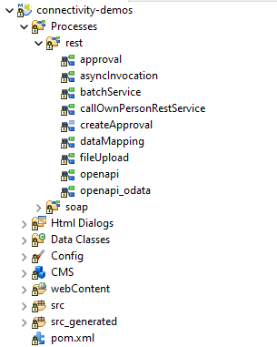

### Approval Demo
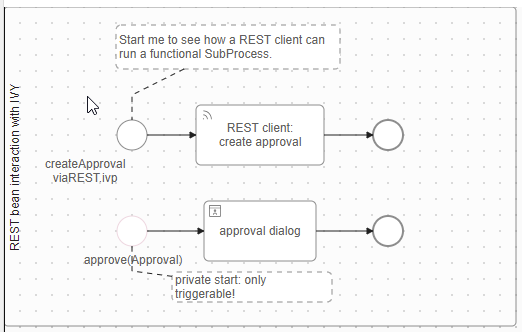

The functional Sub-Process "createApproval" is invoked by the REST call
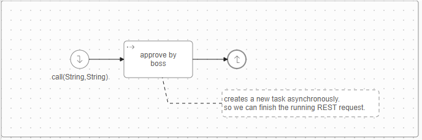

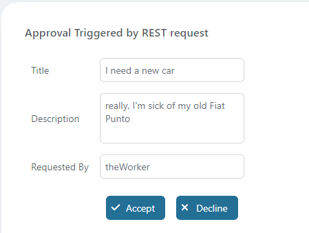

### Async Demo
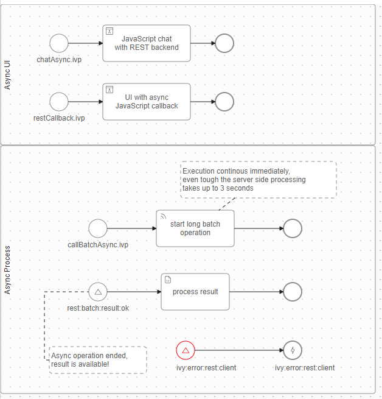

### batchService Demo
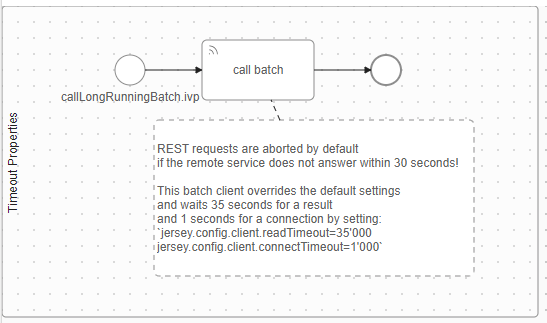

### callOwnPersonRestService Demo
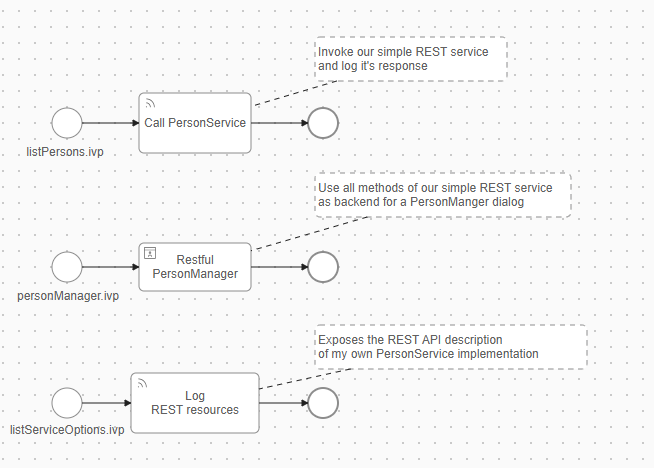

UI for the process "personManager.ivp" - where it is shown how to use all methods of the self-created REST service
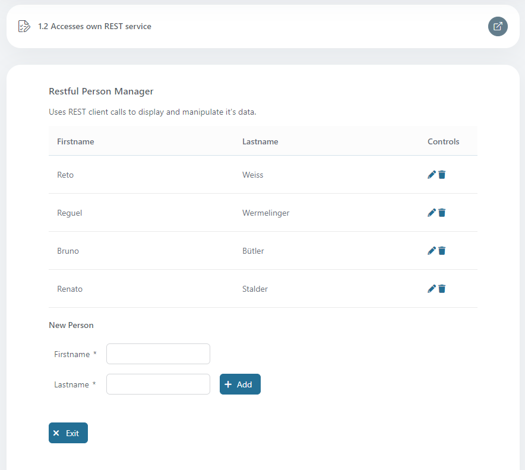

In this demo a REST client has been created, providing GET, PUT, POST and DELETE 
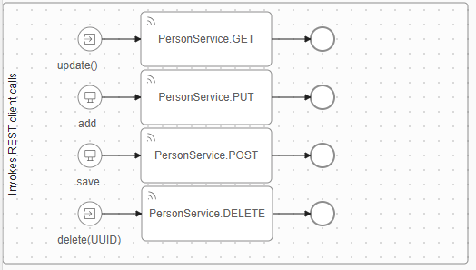

### dataMapping Demo
Various options are shown here on how you can design the data mapping in a REST call.
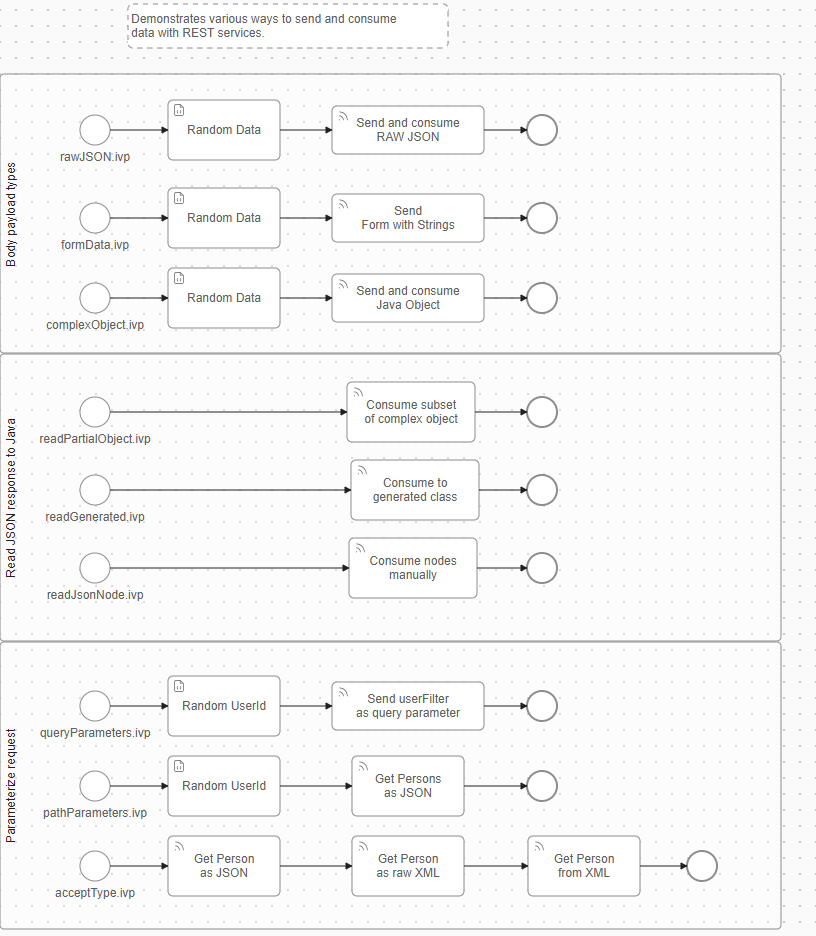

### fileUpload Demo
This Demo uses a Rest Service Call to upload a File.  
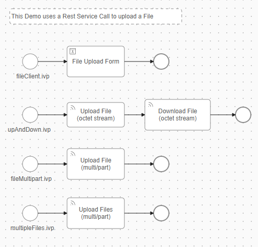

There is also a demo showing a nice UI for various solutions to upload a file.
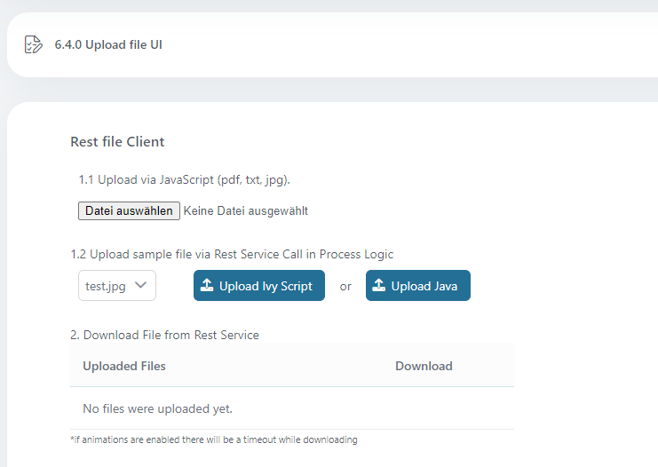

### openapi Demo

OpenAPI is a specification for building APIs, allowing developers to define, describe, and document RESTful web services in a standardized, machine-readable format. It simplifies the integration a lot - this is of course also true for the integration into an Axon Ivy application.  
  
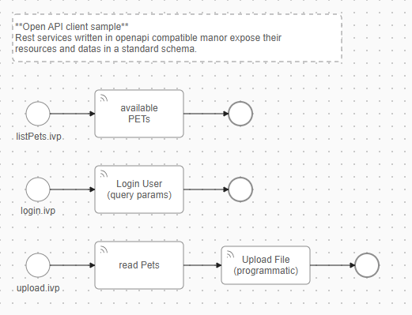
  
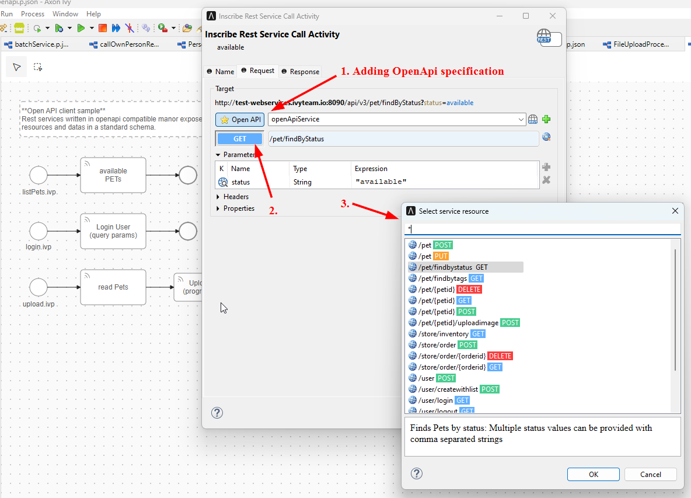

### openapi odata Demo

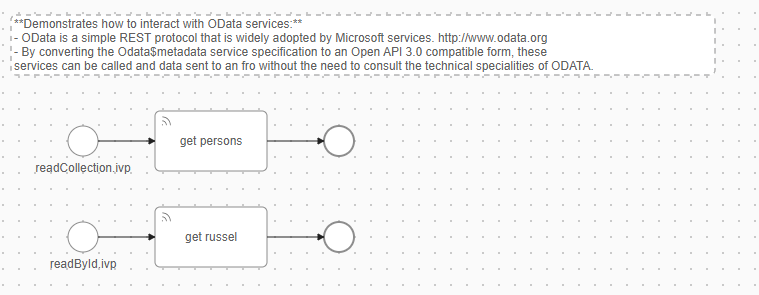

## Setup

Simply install the connector from within the Designer - nothing else needs to be done :blush:
  
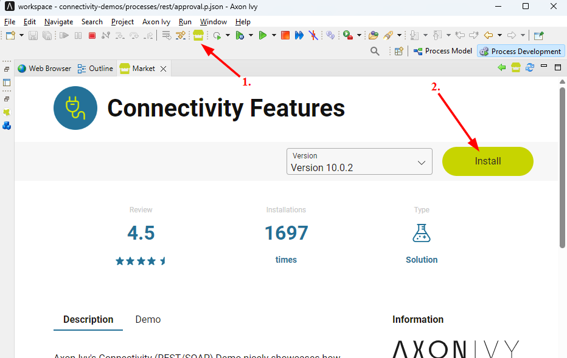
