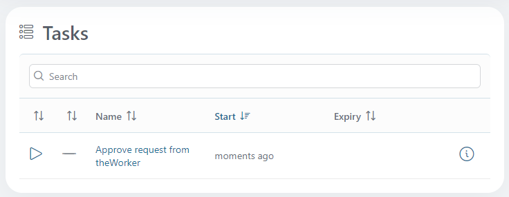
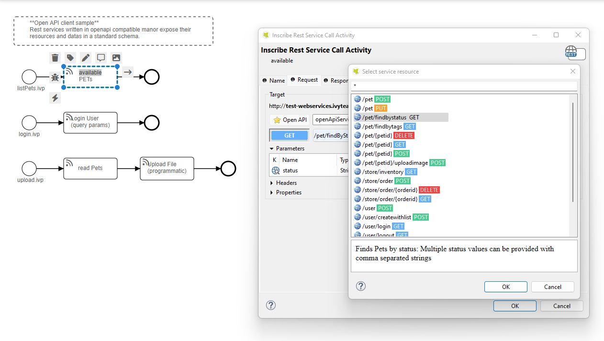

# Connectivity Demo
Axon Ivy's Connectivity (REST/SOAP) Demo nicely showcases using standard architecture principles to create interactive
applications with web services.

The solution:
 
- illustrates how to access your own REST service
- contains an example of a business process that is called via a REST service
- shows asynchronous services via REST (own chat implementation)
- shows how easy data mapping using REST works
- illustrates the uploading of data via REST
- demonstrates REST in combination with OpenAPI and OData
- gives many examples of how to use SOAP service within the platform

Learn more about [3rd party integration](https://developer.axonivy.com/doc/9/concepts/3rd-party-integration/index.html) in our documentation.

## Demo

Once you have successfully installed the connectivity connector in the Designer, you will have a number of examples at your fingertips:

### Approval Demo

### Async Demo

### batchService Demo

### callOwnPersonRestService Demo

UI for the process "personManager.ivp" - where it is shown how to use all methods of the self-created REST service

In this demo a REST client has been created, providing GET, PUT, POST and DELETE 

## Setup

Simply install the connector from within the Designer - nothing else needs to be done :blush:

