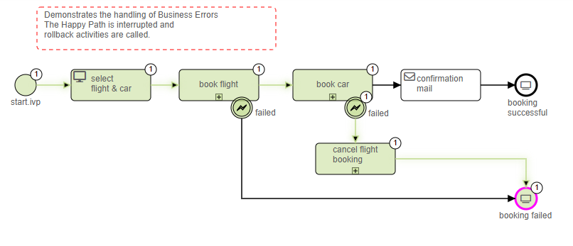
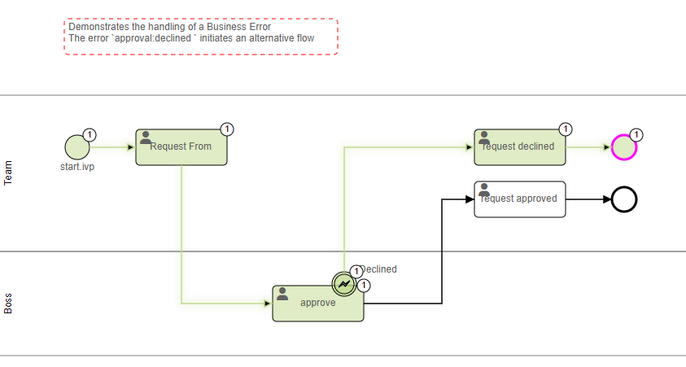

# Error Handling Demo
Axon Ivy's Error Handling Demo nicely showcases how easy it can be to react to
exceptions during process automation. Errors are used to model exceptional
process paths. With an error the happy path of a process is left. In Axon Ivy,
errors are divided into technical errors (e.g. database connection problem) and
business errors (e.g. approval declined). The solution:
 
- illustrates a business error that initiates an alternative flow
- demonstrates a business error that interrupts the happy path and calls
  rollback activities
- shows how a business process ends due to a business error
- includes an example of how to catch an ivy error locally and propagate it as a
  custom error
- exemplifies the use of global errors
- gives access to ready-to-use templates such as cancelling a dialog

Learn more about [error handling](https://developer.axonivy.com/doc/9/concepts/error-handling.html) in our documentation.

## Demo

