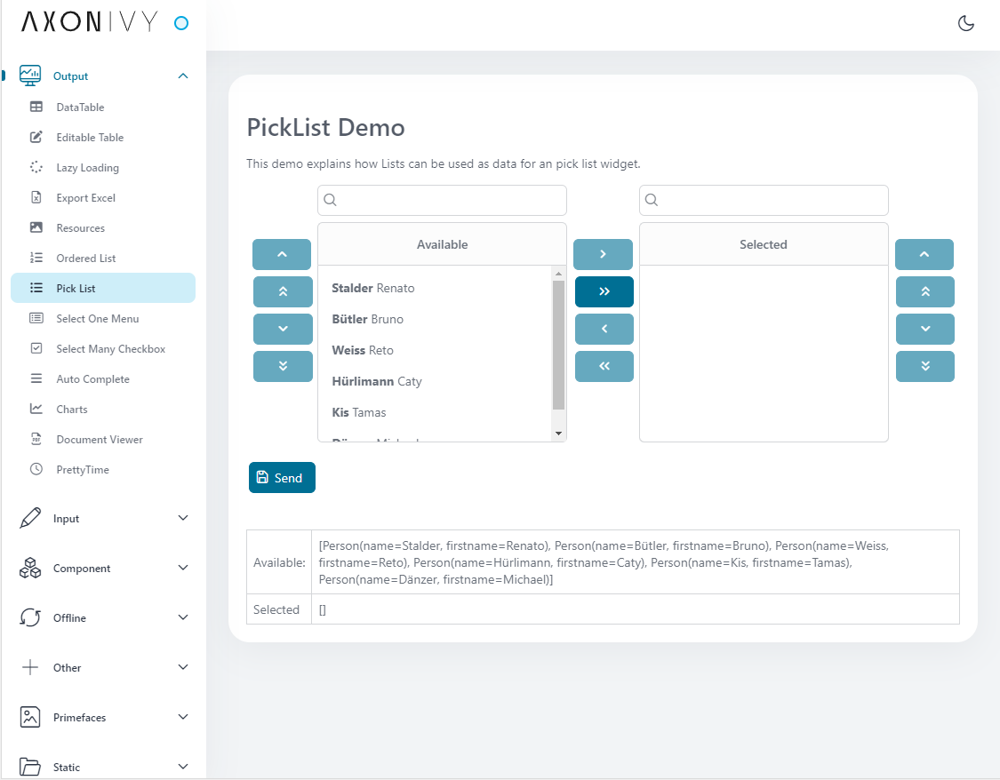
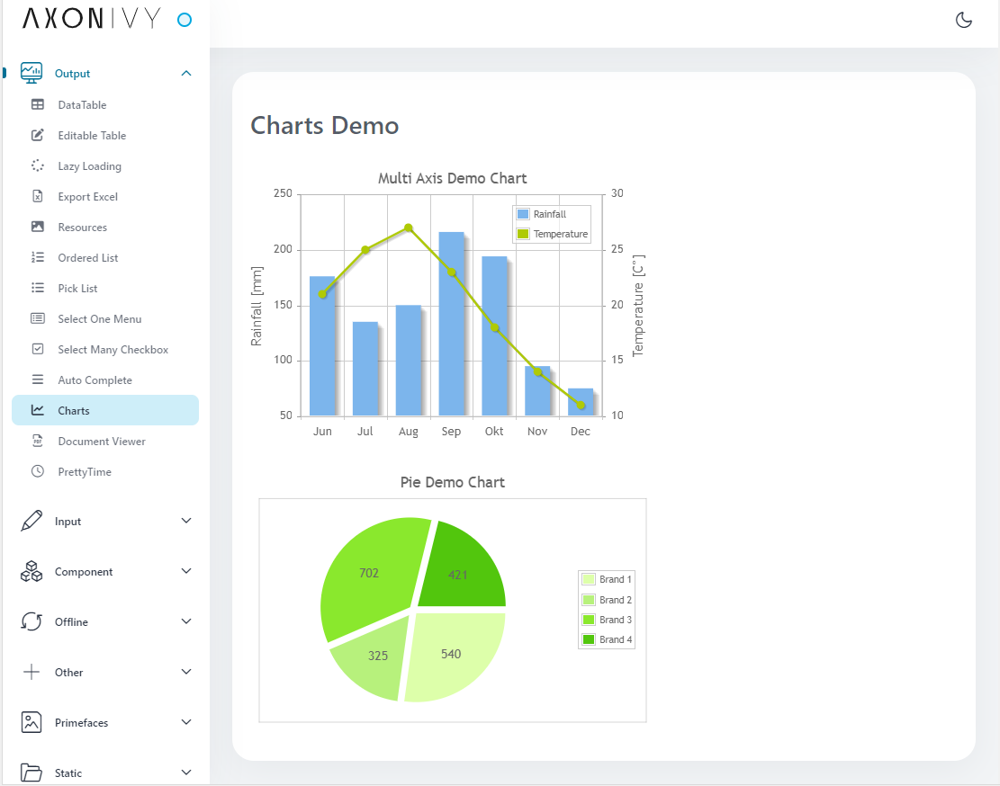
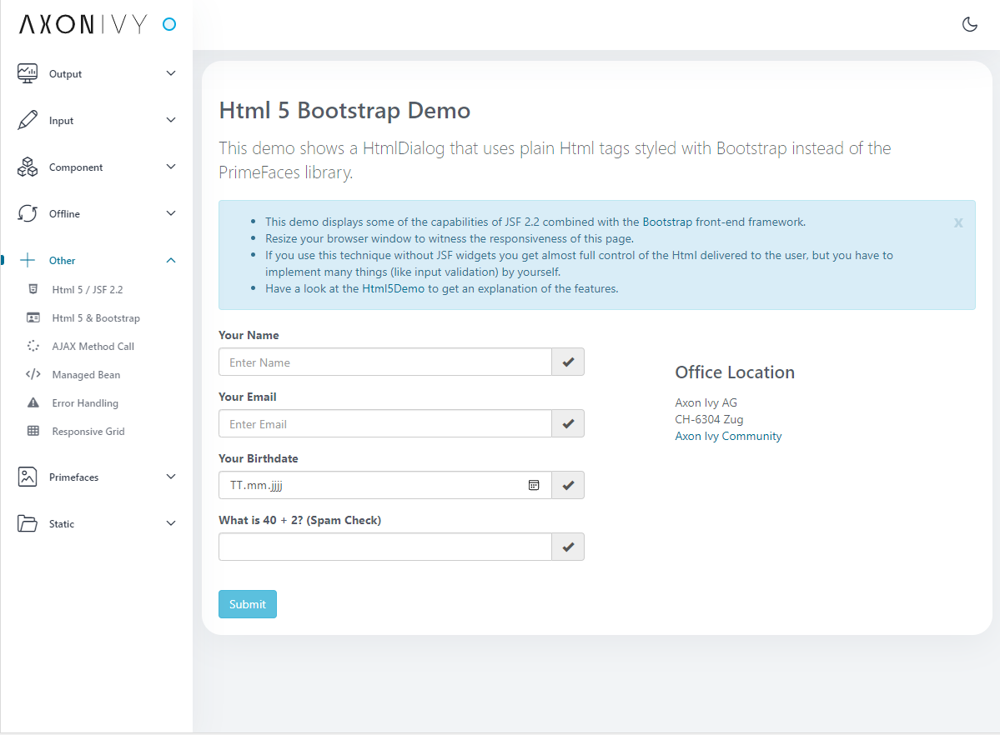

# HTML Dialog Demo
Axon Ivy's HTML Dialog Demo gives you all the power you need to make shiny,
user-friendly forms. More than 100 widgets are ready and waiting to be used in
your UIs. But this demo offers even more. Simply copy HTML Dialog with all the
logic in your project to quick start your digital process automation. The
solution:
 
- includes sample widgets for data input such as file upload, form elements and
  validation
- exemplifies data output possibilities featuring charts, data tables, picklists
  and many more
- includes examples for static HTML dialogs and offline forms
- introduces concepts such as reusable form components
- gives access to front-end framework integration such as plain HTML5 or
  bootstrap

Learn more about [user interface](https://developer.axonivy.com/doc/9/designer-guide/user-interface/index.html)
in our documentation.

## Demo

