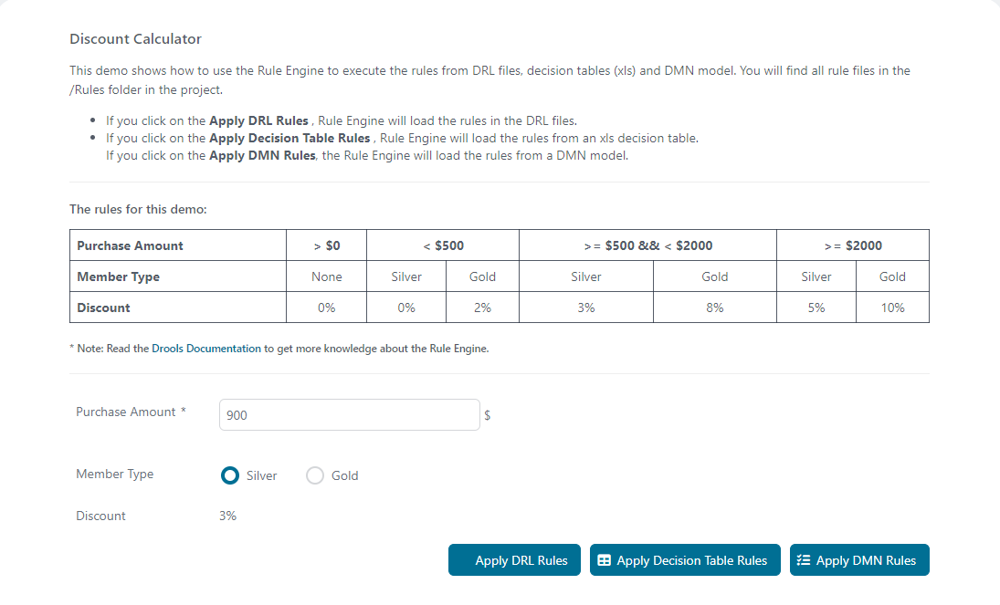
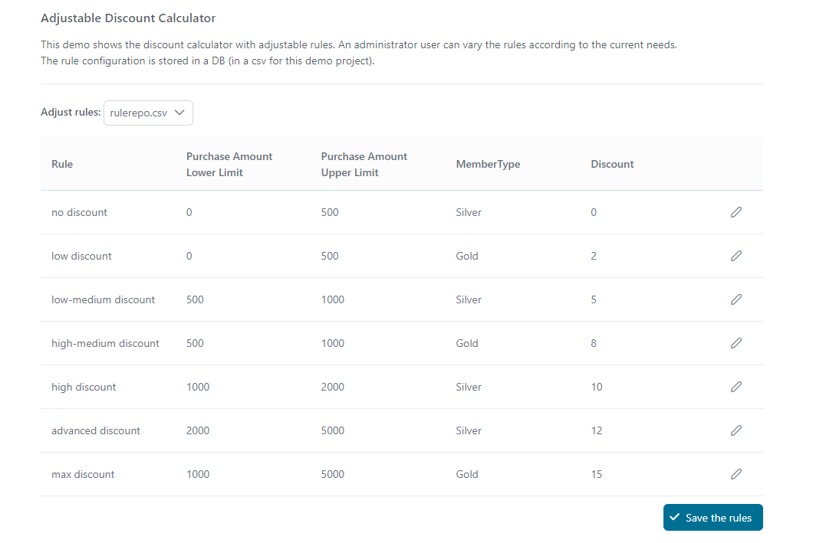

# Rule Engine Demo
Axon Ivy's Rule Engine Demo emphasizes the importance of separating business
logic from process logic. A business rule typically changes more often than the
process model and also has a different target audience. Thanks to the integrated
business rule engine, this is a no-brainer with Axon Ivy. The solution:
 
- showcases the use of different rule definition standards such as DMN, DRL
  files and Microsoft Excel decision table integration
- includes a ready-to-copy example featuring adjustable thresholds for business
  users

Learn more about the [rule engine](https://developer.axonivy.com/doc/9/designer-guide/how-to/rule-engine.html)
in our documentation.

## Demo

