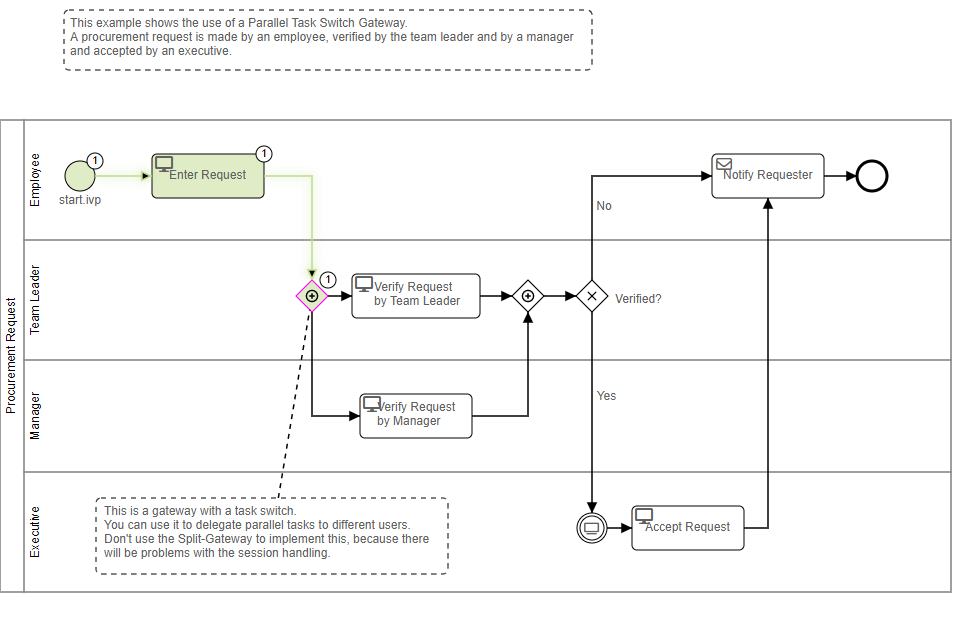
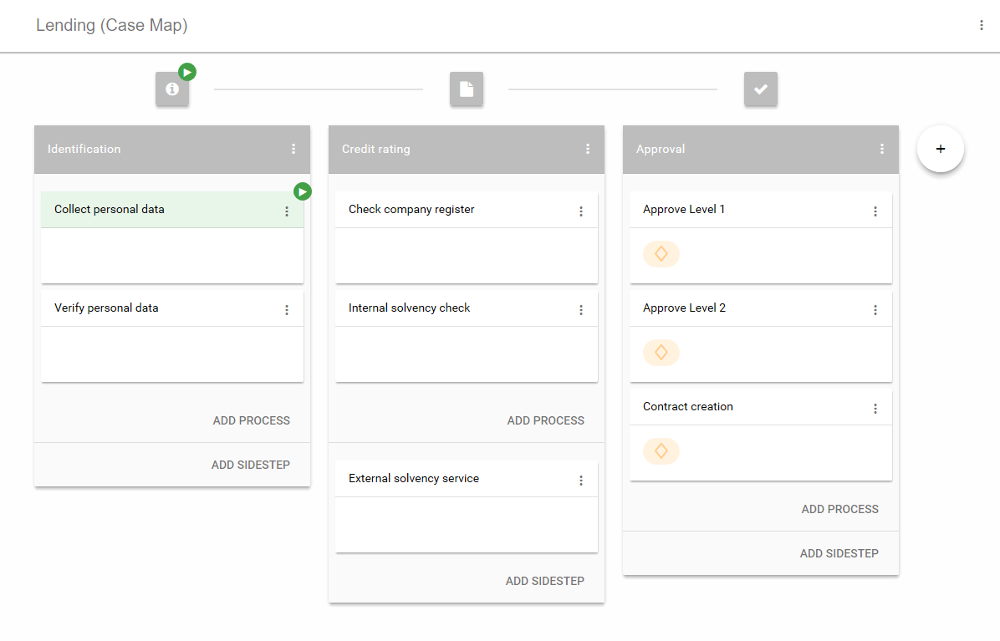

# Workflow Demo
Axon Ivy's Workflow Demo is a must-have for anyone embarking on the process
automation journey. Accelerate time-to-market using a powerful digital process
automation platform featuring processes, rules, adaptive case management (ACM)
and ad-hoc work. The solution:
 
- includes a fully-functional Casemap with ACM-features and agile processes
- demonstrates sequential and parallel task handling with human interaction
- highlights the concept and power of signals and triggers
- exemplifies the need of business data and its usage
- includes many more examples in combination with workflow activities

Learn more about [workflow](https://developer.axonivy.com/doc/9/designer-guide/how-to/workflow.html) and [adaptive case management](https://developer.axonivy.com/doc/9/concepts/adaptive-case-management.html) in our documentation.

## Demo

